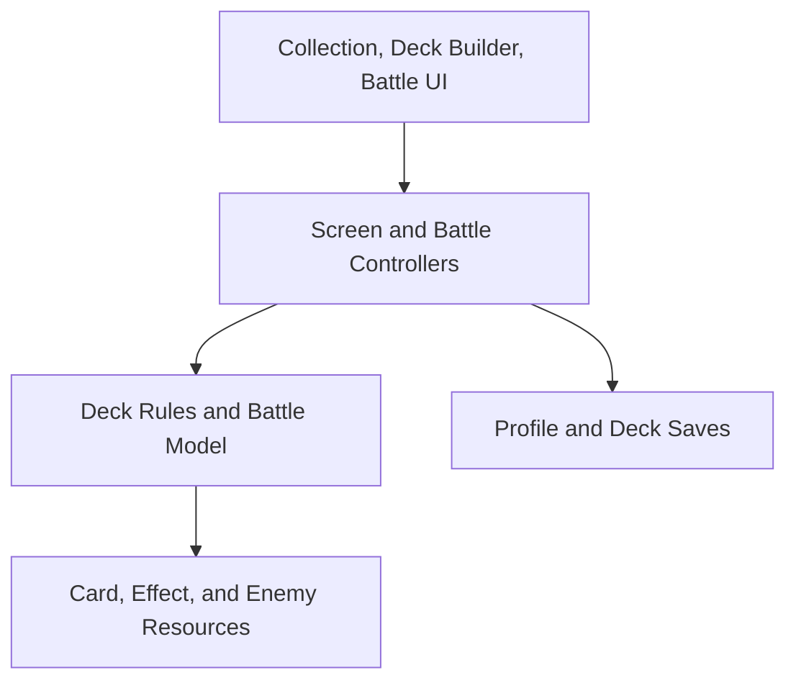

The best fit is a data-driven architecture where card/enemy definitions are immutable `Resource`s, battle state is plain runtime data, and UI scenes communicate with the battle engine through commands and events. This keeps individual card abilities flexible without turning every card into a custom scene.

Assumptions for now:

* Godot 4.x
* Local/offline saves
* Unit and one-shot action cards
* Fixed energy refilled every player turn
* Player may play cards and attack in any order before ending the turn
* Units attack the single enemy
* Enemy actions are scripted
* Destroyed/discarded cards reshuffle when the draw pile empties
* All cards are available
* Multiple decks can be saved
* Deck size is 1–20 until you establish a minimum

## High-level architecture



The important boundary is that the UI never directly changes health, energy, hands, or board state. It asks the battle controller to perform an action.

## 1. Card architecture

Use three separate concepts:

| Concept          | Purpose                         | Lifetime                 |
| ---------------- | ------------------------------- | ------------------------ |
| `CardDefinition` | Permanent card data             | Loaded from `.tres`      |
| `CardBehavior`   | Custom `on_played()` logic      | Attached to a definition |
| `CardInstance`   | Runtime health and battle state | One battle               |

Godot Resources work well for definitions because they are serialized, Inspector-editable data containers. Runtime instances should remain separate because loaded Resources are shared rather than copied automatically. [Godot Resources documentation](https://docs.godotengine.org/en/stable/tutorials/scripting/resources.html)

```gdscript
class_name CardDefinition
extends Resource

enum CardType {
    UNIT,
    ACTION
}

@export var id: StringName
@export var display_name: String
@export_multiline var description: String
@export var artwork: Texture2D

@export var card_type: CardType
@export_range(0, 100) var attack: int
@export_range(1, 100) var health: int = 1
@export_range(0, 20) var cost: int

@export var behavior: CardBehavior
```

```gdscript
class_name CardBehavior
extends Resource

func on_played(context: EffectContext, card: CardInstance) -> void:
    pass
```

A card with completely custom behavior can override it:

```gdscript
class_name LifeDrainBehavior
extends CardBehavior

@export var drain_amount := 3

func on_played(context: EffectContext, card: CardInstance) -> void:
    context.damage_enemy(drain_amount)
    context.heal_player(drain_amount)
```

This is preferable to making a new card scene or full card class for every card. Multiple cards can reuse the same behavior, while unusual cards can receive a unique behavior subclass.

`CardInstance` contains mutable battle data:

```gdscript
class_name CardInstance
extends RefCounted

var instance_id: int
var definition: CardDefinition
var current_health: int
var has_attacked_this_turn := false
var turn_played: int
```

`RefCounted` is appropriate for lightweight runtime objects that do not need to live in the scene tree. [Godot RefCounted documentation](https://docs.godotengine.org/en/stable/classes/class_refcounted.html)

### Playing a card

* `UNIT`: call `on_played()`, then place it on the battlefield.
* `ACTION`: call `on_played()`, then place it in the discard pile.
* Both use the same cost, attack, health, and behavior structure.
* Whether new units can attack immediately belongs in `BattleRules`.

## 2. Battle state

`BattleSession` should contain all authoritative state:

```text
BattleSession
├── rules
├── turn_number
├── phase
├── player_health
├── current_energy
├── draw_pile
├── hand
├── battlefield
├── discard_pile
├── enemy_instance
└── random_number_generator
```

Recommended phases:

```text
SETUP
PLAYER_TURN
RESOLVING_ACTION
ENEMY_TURN
VICTORY
DEFEAT
```

During `PLAYER_TURN`, the UI may issue:

* `play_card(card_instance_id)`
* `attack_enemy(card_instance_id)`
* `end_turn()`

The controller validates every command:

* Is it the player’s turn?
* Is the card in the correct zone?
* Is there enough energy?
* Has the unit already attacked?
* Is the battle already over?

The command is rejected without changing state if any validation fails.

## 3. Battle controller and event queue

`BattleController` is the only Node that controls a battle. It owns a `BattleSession` and an `ActionResolver`.

```gdscript
func request_play_card(card_id: int) -> void:
    if not action_resolver.can_play_card(session, card_id):
        invalid_action.emit("That card cannot be played")
        return

    action_resolver.play_card(session, card_id)
```

Every resolved action produces events such as:

* `CardDrawn`
* `CardPlayed`
* `EnergyChanged`
* `DamageApplied`
* `CardDestroyed`
* `EnemyActionStarted`
* `TurnStarted`
* `BattleEnded`

The Battle UI listens for these events and animates them. Inputs remain locked while an event sequence is being presented.

This prevents animation timing from becoming part of the game rules.

## 4. Safe effect context

A card behavior should not receive the Battle scene or unrestricted access to `BattleSession`. Give it an `EffectContext` exposing approved operations:

```gdscript
context.damage_enemy(amount)
context.damage_unit(instance_id, amount)
context.heal_player(amount)
context.draw_cards(amount)
context.modify_unit_attack(instance_id, amount)
context.create_card_in_hand(card_id)
```

This provides two major benefits:

* Effects automatically generate consistent battle events.
* A card cannot accidentally manipulate UI nodes or corrupt card zones.

Later, you can add other hooks without changing the card architecture:

```gdscript
on_played()
on_turn_started()
on_attack()
on_damaged()
on_destroyed()
```

For the MVP, implement only `on_played()`.

## 5. Enemy architecture

Treat enemies similarly to cards:

```text
EnemyDefinition
├── id
├── name
├── artwork
├── maximum_health
└── behavior: EnemyBehavior
```

```gdscript
class_name EnemyBehavior
extends Resource

func get_turn_actions(context: EnemyDecisionContext) -> Array[EnemyAction]:
    return []
```

Enemy scripts return actions rather than directly changing the battle.

Example behaviors:

* Attack for 5 every turn.
* Alternate between attack and healing.
* Use a powerful attack every third turn.
* Change phases below 50% health.
* Choose an action based on the number of battlefield cards.

Enemy actions can use the same resolution infrastructure as card effects:

* `DamageBoardAction`
* `DamagePlayerAction`
* `HealEnemyAction`
* `ApplyStatusAction`

## 6. Battlefield damage policy

Put this rule behind a strategy object instead of inside the enemy:

```gdscript
class_name BoardDamagePolicy
extends RefCounted

func apply_damage(
    context: EffectContext,
    amount: int
) -> void:
    pass
```

For your current rule, use `SpreadBoardDamagePolicy`:

1. If there are no units, damage the player.
2. Otherwise distribute damage one point at a time across living units.
3. Remove destroyed units as distribution continues.
4. If every unit dies and damage remains, apply the overflow to the player.

This makes cards collectively act as the player’s protective wall while respecting their individual health.

Because damage assignment is isolated, you can later change to taunt, board order, random targets, or scripted targeting without rewriting enemies.

## 7. Decks, collection, and saving

`CardCatalog` loads every `CardDefinition` and maps stable IDs to definitions:

```gdscript
var cards_by_id: Dictionary[StringName, CardDefinition]
```

The Collection screen displays everything returned by this catalog.

A saved deck contains IDs, not copies of Resources:

```gdscript
class_name DeckRecord
extends RefCounted

var id: String
var name: String
var card_ids: Array[StringName]
```

Example save data:

```json
{
  "schema_version": 1,
  "selected_deck_id": "starter",
  "decks": [
    {
      "id": "starter",
      "name": "My First Deck",
      "card_ids": ["shield_bot", "shield_bot", "life_drain"]
    }
  ]
}
```

Save under `user://profile.json`.

Stable card IDs are important: renaming or reorganizing a `.tres` file will not invalidate a deck.

Use a `DeckRules` object for:

* Maximum deck size: `20`
* Minimum deck size: initially `1`
* Maximum copies per card: configurable
* Whether decks containing missing card IDs remain editable

## 8. Global objects

Use only a few Autoloads:

* `CardCatalog` — loads and indexes content
* `ProfileStore` — loads and saves decks
* `SceneNavigator` — optional scene changes

Do **not** make the current battle an Autoload. The Battle scene should own its session and dispose of it when the battle ends. Autoloads are best reserved for information needed across scenes. [Godot Autoload documentation](https://docs.godotengine.org/en/stable/tutorials/scripting/singletons_autoload.html)

## 9. Suggested project structure

```text
res://
├── autoload/
│   ├── card_catalog.gd
│   └── profile_store.gd
├── cards/
│   ├── definitions/
│   ├── behaviors/
│   └── card_definition.gd
├── enemies/
│   ├── definitions/
│   ├── behaviors/
│   └── actions/
├── battle/
│   ├── model/
│   │   ├── battle_session.gd
│   │   ├── card_instance.gd
│   │   └── enemy_instance.gd
│   ├── rules/
│   ├── effects/
│   ├── events/
│   ├── battle_controller.gd
│   └── battle_scene.tscn
├── decks/
│   ├── deck_record.gd
│   ├── deck_rules.gd
│   └── deck_builder_scene.tscn
├── collection/
│   └── collection_scene.tscn
├── ui/
│   ├── card_view.tscn
│   ├── card_view.gd
│   └── components/
└── tests/
```

## 10. Configurable battle rules

Create one `BattleRules.tres` containing the numbers we have not settled:

* Player starting health
* Fixed energy per turn
* Starting hand size
* Cards drawn each turn
* Maximum hand size
* Maximum battlefield size
* Whether units can attack on the turn played
* Maximum deck size
* Duplicate-card limit
* Whether excess board damage spills into player health

My recommended starting values are:

| Rule                  | Initial value |
| --------------------- | ------------: |
| Player health         |            30 |
| Energy each turn      |             5 |
| Starting hand         |             3 |
| Draw per turn         |             1 |
| Maximum hand          |             8 |
| Maximum battlefield   |             5 |
| Attack on turn played |            No |
| Maximum deck          |            20 |
| Copies per card       |             2 |
| Damage overflow       |           Yes |

## 11. Implementation order

1. Build `CardDefinition`, `CardBehavior`, and `CardInstance`.
2. Build a headless `BattleSession` supporting draw, play, attack, discard, reshuffle, and turns.
3. Add three test cards: basic unit, damage action, life-drain action.
4. Add one scripted enemy with a repeating action pattern.
5. Build the Battle UI on top of commands and events.
6. Build `CardCatalog` and the Collection screen.
7. Build deck validation, multiple saved decks, and persistence.
8. Add content validation and automated battle-rule tests.

The most important early milestone is a battle that can run entirely without UI. Once that works, card visuals, animations, deck building, and future features become much safer to add.
